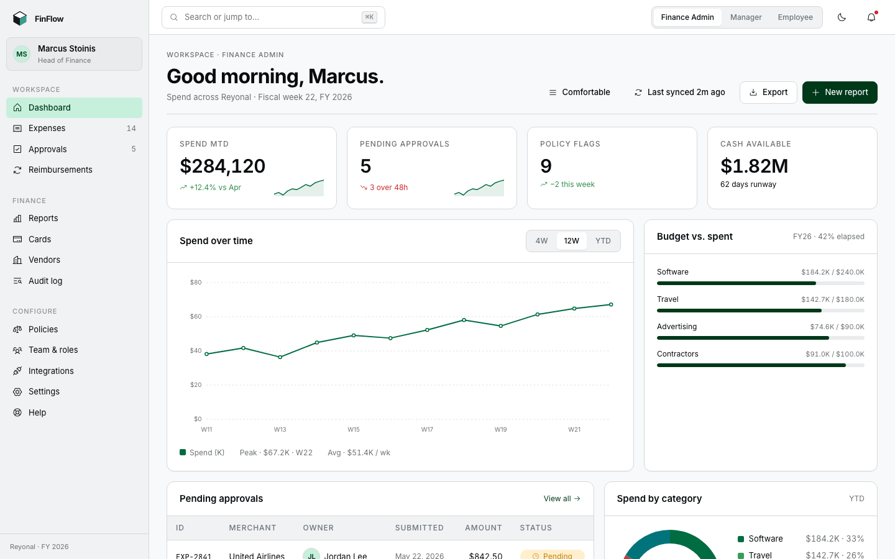
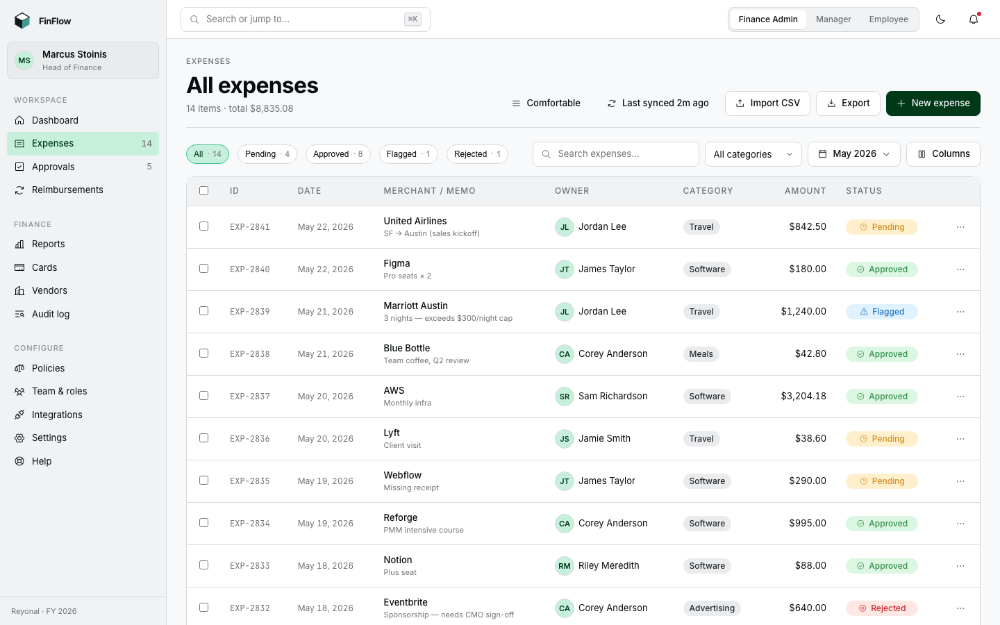
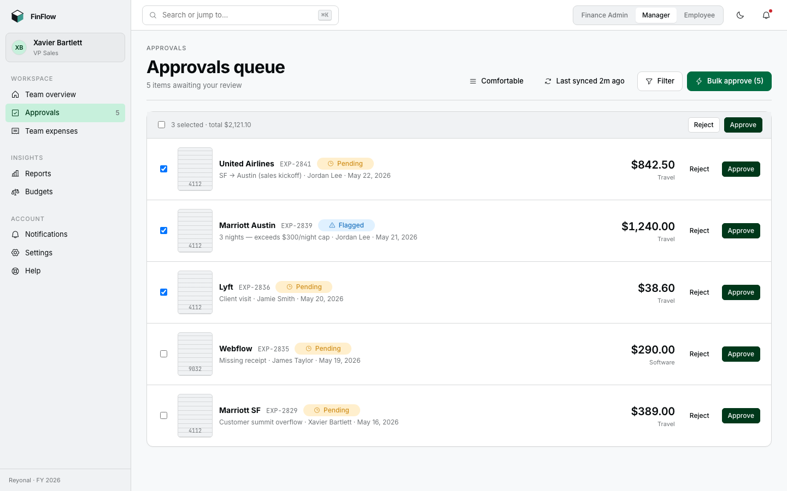
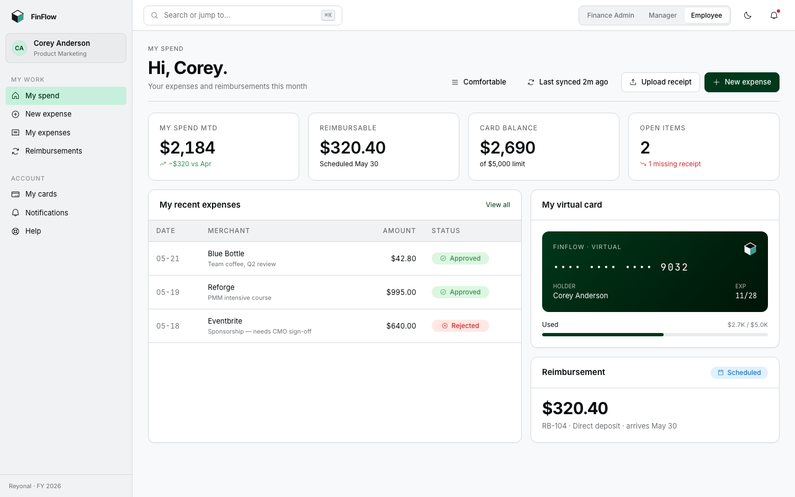
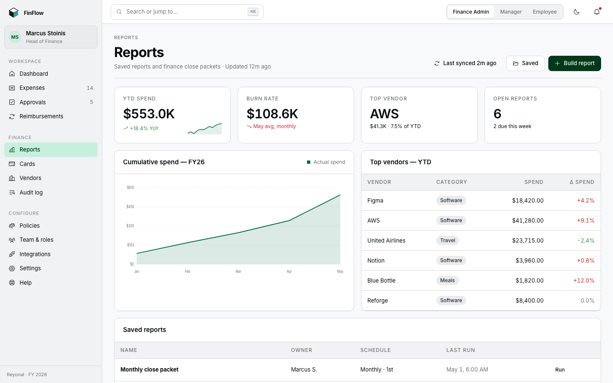

# FinFlow — B2B Expense Management Platform

**Live case study:** [naveensereddy.com/case-finflow](https://naveensereddy.com/case-finflow)

A UX case study built around a problem finance teams deal with constantly: expense reports stuck in approval limbo, spreadsheets nobody trusts, and a finance lead who can't answer "what did we spend this quarter" without a week of digging.

FinFlow is my answer to that. A B2B expense platform designed for three people who all touch the same expense at different points: the employee submitting it, the manager approving it, and the finance admin who has to reconcile, audit, and report on all of it.

## Why I built it this way

Most expense tools I looked at design for one persona and bolt the others on. I started from the opposite direction. I mapped all three roles' journeys first, found where they collided — a manager approving 40 line items with no context, an admin unable to trace an approval back to who actually reviewed it — and built the information architecture around those collision points instead of around a generic "expense object."

One decision paid off more than any other: the audit log was originally buried three levels deep in Settings. Round-1 usability testing found only 50% of finance admins could locate it. I promoted it to a top-level nav item, and round 2 put that at 92%. Composite first-try task success across the whole product went from 73% to 89% between rounds. And when I put the visual design in front of finance-team stakeholders, 5 of 6 said, unprompted, that it didn't look like Brex — which was the actual brief, since most of this category defaults to looking like a bank statement.

## What's in this repo

**`docs/`** — the research: business context, discovery notes, personas, user journeys, IA decisions, before/after analysis, and the full outcomes writeup with the round-1 vs round-2 usability numbers.

**`ui_kits/finflow/`** — the working interactive prototype. Open `ui_kits/finflow/index.html` in a browser for the desktop app (admin, manager, and employee views), or `ui_kits/finflow/mobile-app.html` for the employee mobile flow.

**`board.html`** — every real screen from the prototype laid out as one Figma-style board with design notes on each — 48 screens across all three roles.

**`foundations/`** — the design tokens and component CSS the whole platform is built on.

**`case-study/`** and **`FinFlow Case Study.html`** — the case-study artifact components (research, personas, wireframes, design system, final UI), viewable as one canvas by opening `FinFlow Case Study.html`.

**`screenshots/`** — the hero screenshots used in this README, exported from the current prototype.

## Role I played

Full UX process end to end: competitive research, user interviews, persona development, information architecture, interaction design, the design system, an accessibility pass, and two rounds of moderated usability testing (Maze, n=12 each round) to validate — and then fix — the approval flow.

## Tools

Figma for design, Maze for usability testing, React for the interactive prototype.

---

Naveen Sereddy — [naveensereddy.com](https://naveensereddy.com) · [github.com/Naveen-Sereddy](https://github.com/Naveen-Sereddy)
