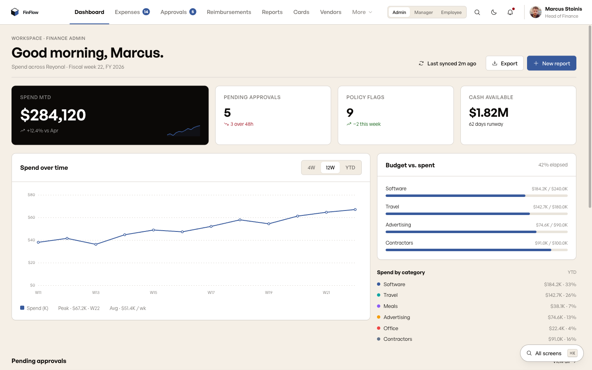
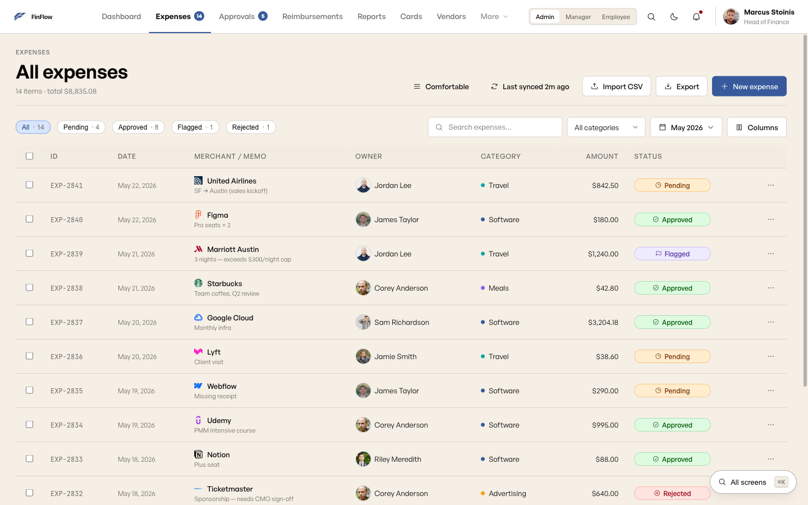
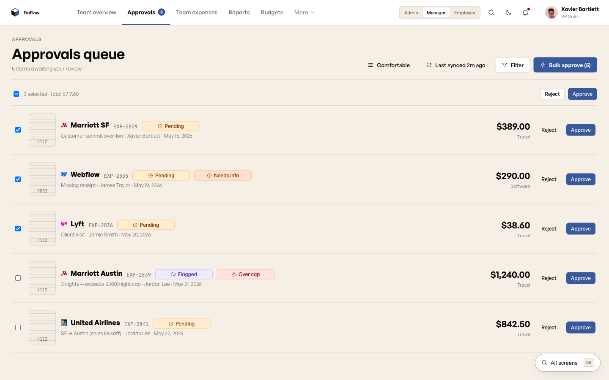
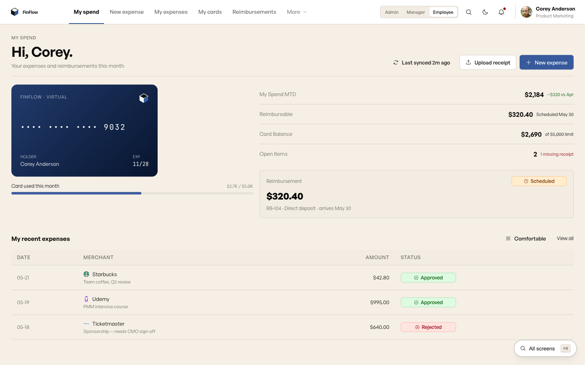
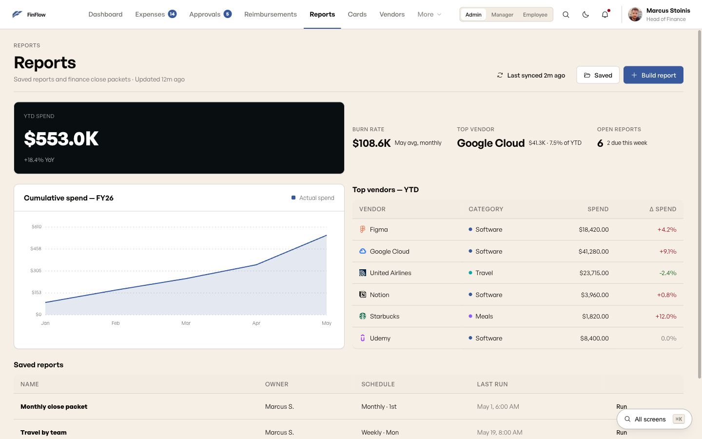

# FinFlow

B2B expense management platform shipped privately for an anonymized Series B SaaS client. Three roles touch the same expense at different points: the employee submitting it, the manager approving it, and the finance admin reconciling and reporting on it. 47 desktop screens, an 8-screen employee mobile flow, and a token-driven UI kit.

**Live case study:** [naveensereddy.com/case-finflow](https://naveensereddy.com/case-finflow)

## Screenshots











## Implemented demonstration

The local app now supports one coherent expense lifecycle. Desktop and mobile share retained drafts, validation, receipt attachments, and durable browser-local records. Reviewers can approve, request correction, or reject with recorded reasons. Personal expenses become eligible for simulated reimbursement after approval; corporate-card expenses follow a separate reconciliation step.

- Finance sees workspace records. Managers see Sales and their own expenses, and cannot review their own submissions. Employees see their own records and cannot approve expenses. These are demo capabilities, not production authentication or authorization.
- Every detail and operation result carries a record or operation ID. Unknown or out-of-scope IDs show an unavailable state.
- Changing filters clears selection. Batch review validates every selected item before changing any record.
- Reports use an explicit interval and approved source records; CSV export matches the displayed records. Card and vendor details reference the same ledger.
- The shell supports phone review and capture, contained table scrolling, visible keyboard focus, and a modal directory with contained/restored focus.
- Setup, account, integrations, support, live OCR, CSV import, custom reports, card issuance, and real payments remain outside the working lifecycle. Design previews are marked and interaction is disabled.

The screenshots above are historical presentation assets and have not been regenerated for this implementation. The separate Portfolio deployment was not synchronized.

## Runtime and persistence

React 18.3.1 and Babel Standalone load from unpkg. The runtime remains a static, zero-build app with Phosphor icons and shared CSS tokens. There is no application server, database, authentication service, card provider, or payment provider.

`ui_kits/finflow/data.js` contains fixtures. `store.js` owns validated operations, scoped selectors, integer-cent money, event history, drafts, and `ff-demo-state-v3` storage. Existing v2 records migrate on the next successful write; the old key is preserved. Unreadable data blocks writes and offers an explicit demo reset. Theme and demo-role preferences are separate.

A receipt file up to 1.5 MB is saved as a data URL in local browser storage. Sample evidence is labeled. Filename-only attachments from the previous implementation cannot be recovered and are described as missing evidence. Storage errors keep the form open and never produce a success result.

Other tabs receive storage events; a mutation reads the latest saved state before applying its changes. This is suitable for a single-user demonstration, not transactional multi-user or multi-tab financial processing. Clearing browser storage removes the local records.

## Run and verify

```bash
npm run dev
npm run check
```

The server prints the canonical desktop URL. The employee entry is `/ui_kits/finflow/mobile-app.html`. The root URL redirects to the canonical product path so assets resolve correctly.

`npm run check` runs structural checks and the domain regression suite. Browser checks require Playwright and its Chromium browser in the execution environment:

```bash
FF_TEST_URL=http://localhost:4173/ui_kits/finflow/ npm run test:browser
```

If Playwright is supplied by a shared runtime, set `FF_PLAYWRIGHT_MODULE` to that module's `index.mjs`. No machine-specific path is embedded in the project.

The browser suite exercises record identity, invalid and edited inputs, draft reload, correction/resubmission, role scope, approval persistence, reimbursements, selection filtering, browser Back, keyboard review, dialog focus, storage failure/retry, and supported widths. See [the release contract](docs/implementation-contract.md) for scope and verification limits.

## Source layout

- `ui_kits/finflow/`: entries, fixtures, domain store, layout, and screens.
- `foundations/`, `brand/`: shared visual components and assets.
- `tests/`, `scripts/`: behavioral/structural verification and development server.
- `case-study/`, `preview/`, `screenshots/`: presentation and design references.

## Remaining scope

Production persistence, server authorization, concurrent transaction guarantees, provider failure/recovery, and payments require a separate service implementation. Large-data pagination and a complete assistive-technology/contrast audit remain follow-ups. Passing the workflow checks is not a WCAG conformance claim.

## License

MIT

---

Naveen Sereddy · [naveensereddy.com](https://naveensereddy.com) · [github.com/Naveen-Sereddy](https://github.com/Naveen-Sereddy)
